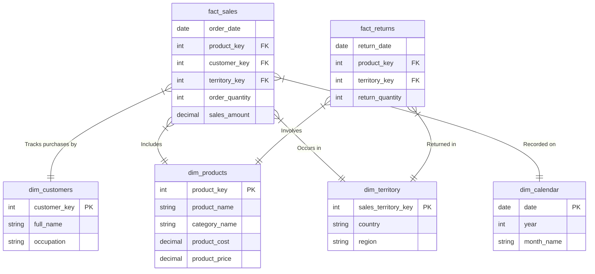
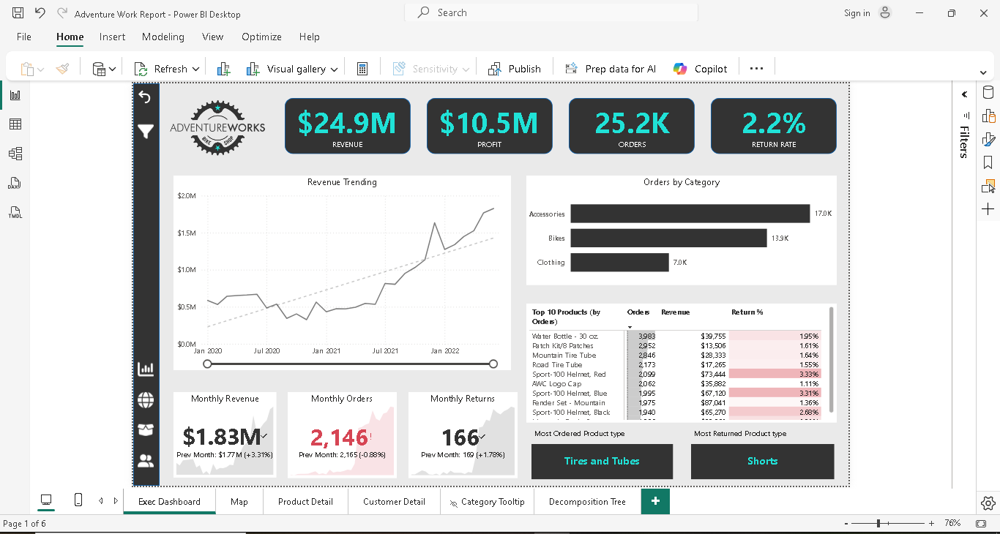

# End-to-End SQL Data Warehouse (Medallion Architecture)

## 📌 Project Overview
This project demonstrates the design and implementation of an enterprise-grade Data Warehouse using Microsoft SQL Server. By applying the **Medallion Architecture** (Bronze, Silver, Gold layers), raw sales and product data from the AdventureWorks dataset was successfully ingested, transformed, and modeled into a robust Star Schema optimized for business intelligence and advanced analytics.

## 🛠️ Tech Stack & Tools
* **Database Management System:** Microsoft SQL Server (T-SQL)
* **Development Environment:** SQL Server Management Studio (SSMS)
* **Data Architecture:** Medallion Architecture (Bronze, Silver, Gold)
* **Data Modeling:** Kimball Dimensional Modeling (Star Schema, Surrogate Keys)
* **Business Intelligence:** Power BI
* **Version Control:** Git & GitHub

## 🏗️ Architecture & Data Pipeline
The ETL pipeline is structured into three distinct layers to ensure data quality and high performance:

* **🥉 Bronze Layer (Raw):** Ingested raw CSV files using dynamic `BULK INSERT`. Preserved raw data formats with relaxed constraints to prevent load failures. Appended multi-year sales data into a single consolidated table.
* **🥈 Silver Layer (Cleansed & Conformed):** Applied rigorous data type casting, standardized text casing, handled nulls, and generated complex calendar dimensions. Enforced referential integrity using Primary and Foreign Key constraints.
* **🥇 Gold Layer (Business & Analytics):** Denormalized product hierarchies into a Star Schema. Dynamically generated **Surrogate Keys** using `ROW_NUMBER()` window functions to replace volatile natural IDs. Created secure, business-ready SQL Views featuring pre-calculated financial metrics.

## 📊 Data Model (Star Schema)
The final Gold layer is modeled to support rapid multidimensional analysis. 

## 📈 Data Visualization & BI Dashboard
To bring the data to life, the Gold layer views were connected to **Power BI** to build an interactive Executive Dashboard. This dashboard allows stakeholders to filter by year, region, and product category to uncover trends in revenue, profit margins, and return rates.

## 📁 Repository Structure
* `/datasets/`: Source CSV files.
* `/scripts/`: Sequential T-SQL scripts to build and load the DW (00 to 05).
* `/analytics/`: Advanced SQL queries (CTEs, Window Functions) answering critical business questions.
* `/docs/`: Contains Power BI dashboard screenshots and project visualizations.
* `Insight_Report.md`: Executive summary of findings based on the data.

## 🚀 How to Run
1. Clone this repository.
2. Open SSMS and execute `00_init_database.sql`.
3. Update the `@base_path` variable in `02_load_bronze_tables.sql` to point to your local `datasets` folder.
4. Execute scripts `01` through `05` in sequential order.
5. Run the queries in `analytics/business_questions.sql` to explore the data.

## 👨‍💻 About the Author

**Saeed Ahmed** *Data Analyst | SQL Developer | Data Engineering Enthusiast*

I am a Data Analyst with a strong foundation in both technical data development and enterprise economics.I bring a unique, business-first perspective to data engineering and analytics. 

I specialize in bridging the gap between raw, unstructured data and executive-level financial insights. This project reflects my passion for building scalable SQL architectures (Medallion & Kimball methodologies) and my ability to extract actionable KPIs—such as profitability, cost-to-revenue ratios, and market basket trends—that drive strategic business decisions.

**Let's Connect!**
* **LinkedIn:** [www.linkedin.com/in/saeed-ahmed-baloch]
* **GitHub:** [https://github.com/SaeedAhmed189](https://github.com/SaeedAhmed189)
* **Email:** [saeedahmedmakrani@gmail.com]